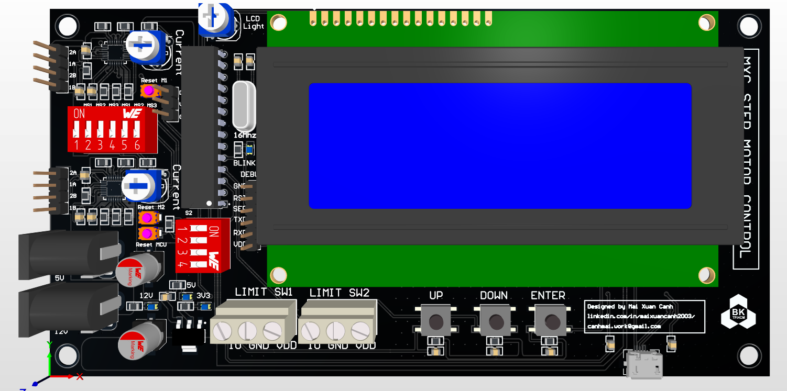
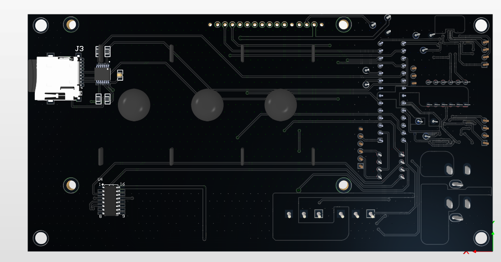

# Menu-Control-Motor Board

👋 Welcome to the **Menu-Control-Motor** board project! This design is created in Altium Designer 21 and is built around the ATMEGA328P microcontroller. It is intended for applications that require menu-based control of motor functions, making it ideal for automation projects, robotic systems, and other control-based applications.

## 📌 Project Overview

The **Menu-Control-Motor** board is designed to provide an intuitive interface for controlling motor functions via a menu-driven setup. With the ATMEGA328P at its core, this board is compact yet powerful, enabling efficient motor control and responsive menu navigation.

### 🔧 Key Features
- **Microcontroller**: ATMEGA328P, known for its reliability and ease of programming.
- **Menu Control**: Designed for navigating and adjusting motor parameters through a menu interface.
- **Motor Control Capabilities**: Supports PWM (Pulse Width Modulation) and digital outputs for controlling motor speed and direction.
- **Compact Design**: Optimized layout for minimal footprint, suitable for embedded applications.

### 📋 Specifications
- **Board Name**: Menu-Control-Motor
- **Microcontroller**: ATMEGA328P
- **Control Interface**: Menu-driven control for motor functions
- **Connectivity**: Supports standard serial interfaces for communication
- **Power Supply**: Designed to operate with standard 5V or 12V power sources

## 📷 Board Images

| View        | Image                             |
|-------------|-----------------------------------|
| **Top View**    |       |
| **Bottom View** |  |

## 🚀 Getting Started
To begin using the **Menu-Control-Motor** board:
1. Open the Altium Designer 21 project file (`.PrjPcb`) to explore or modify the design.
2. Program the ATMEGA328P with firmware for motor control.
3. Connect the board to your motor setup and power supply.
4. Use the menu interface to control motor parameters and test functionality.

## 🛠 Usage Examples
1. **Motor Speed Control**: Adjust the motor speed via PWM signals.
2. **Directional Control**: Change motor rotation direction using the digital output pins.
3. **Menu Navigation**: Use buttons or a rotary encoder to navigate through the menu options for fine-tuning motor performance.

---

🔗 **See Also**  
- [ATMEGA328P Datasheet](https://ww1.microchip.com/downloads/en/DeviceDoc/ATmega328_P_DataSheet.pdf)
- [Altium Designer 21 Documentation](https://www.altium.com/documentation/altium-designer/)

## Contact

For any questions or additional support, feel free to reach out:

- **Name**: Mai Xuan Canh
- **University**: Ho Chi Minh City University of Technology (HCMUT)
- **Major**: Control and Automation Engineering
- **LinkedIn**: [Canh Mai's LinkedIn](https://www.linkedin.com/in/maixuancanh2003/)
- **Email**: canhmai.work@gmail.com

---

